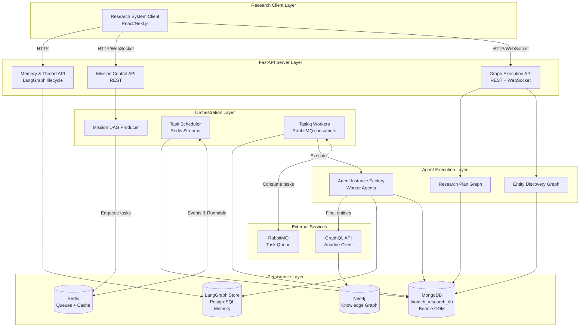

# Research Ingestion System - Agent Instructions

## Executive Summary

The **Human Upgrade Research Ingestion System** is a sophisticated, multi-layered AI research platform that discovers, researches, and structures biotech knowledge from unstructured sources into a queryable knowledge graph. The system combines LangGraph-powered AI agents, distributed task orchestration (Taskiq + RabbitMQ + Redis), MongoDB persistence, Neo4j knowledge graph storage, and FastAPI servers to create an end-to-end research automation pipeline.

**Key Capabilities:**
- **Automated Entity Discovery**: From raw queries/sources → structured entity candidates (people, orgs, products, compounds, tech)
- **Intelligent Research Planning**: Creates multi-stage, multi-agent research plans with dependency management
- **Distributed Execution**: Executes research plans as DAGs using worker pools
- **Memory & Learning**: Semantic, episodic, and procedural memory via LangGraph store
- **Knowledge Graph Storage**: Final entities, relationships, and evidence stored in Neo4j
- **Human-in-the-Loop**: Optional checkpointing, time-travel, and manual intervention

---

## System Architecture (30,000 ft View)



---

## Core Workflow (End-to-End)

### Phase 1: Entity Discovery & Candidate Extraction

**Input**: User query + optional starter sources/content
**Output**: Connected entity candidates with validated sources

**Graph**: `EntityIntelConnectedCandidatesAndSources`

```
Query: "Research Ozempic and its manufacturer"
Starter Sources: ["https://www.novonordisk.com"]
          ↓
[Seed Extraction Node]
  → Identifies: Novo Nordisk (org), Ozempic (product), semaglutide (compound)
          ↓
[Official Sources Node]
  → Discovers official domains, help centers, research pages
          ↓
[Domain Catalogs Node]
  → Maps URL structures per domain (products, leadership, docs, etc.)
          ↓
[Fan-out: Candidate Slices]
  → Per domain catalog:
      - OrgIdentityPeopleTech slice (company, people, tech stack)
      - ProductsCompounds slice (offerings, ingredients)
  → Assembler: Merges slices into ConnectedCandidates
          ↓
[Persist Candidates]
  → MongoDB: candidate_seeds, domain_catalogs, connected_candidates
          ↓
OUTPUT: CandidateSourcesConnected
```

**Key Features:**
- Fanout parallelization (multiple domains processed concurrently)
- Structured outputs (Pydantic models validated at each step)
- Persistence at every major checkpoint (Beanie ODM)
- Intel run tracking (runId, pipelineVersion, timestamps)

---

### Phase 2: Research Plan Generation

**Input**: Connected candidates + research mode + tool recommendations
**Output**: ResearchMissionPlanFinal (DAG-ready agent instances)

**Graph**: `ResearchPlanCreationGraph`

```
ConnectedCandidates + ResearchMode ("full_entities_basic")
          ↓
[Build Initial Plan Node]
  → Determines stages (S1: Identity, S2: Products, S3: Evidence, S4: Synthesis)
  → Creates agent instances (WITHOUT sources yet)
  → Applies slicing logic (e.g., 5 products/agent max)
          ↓
OUTPUT: InitialResearchPlan
  - stages: [S1, S2, S3, S4]
  - sub_stages: [S1.1, S1.2, ...]
  - agent_instances: [AgentInstancePlanWithoutSources × N]
          ↓
[Source Expansion Node]
  → Uses web search + domain catalogs to find:
      - Competitor URLs
      - Research paper URLs
      - News/press URLs
  → Curates sources by category (official, scholarly, marketplace, etc.)
          ↓
OUTPUT: SourceExpansion
          ↓
[Attach Sources to Agent Instances Node]
  → Matches expanded sources to agent instance needs
  → Produces AgentInstancePlanWithSources
  → Enforces invariants (slice, objectives, dependencies preserved)
          ↓
OUTPUT: AgentInstancePlansWithSources
          ↓
[Assemble Final Plan Node]
  → Validates 1:1 mapping (initial instances ↔ instances with sources)
  → Validates stage references (no dangling instance_ids)
  → Produces ResearchMissionPlanFinal
          ↓
OUTPUT: ResearchMissionPlanFinal
  - mission_id
  - stage_mode
  - target_businesses/people/products
  - stages + sub_stages (with instance_id references)
  - agent_instances: [AgentInstancePlanWithSources × N]
```

**Key Features:**
- Deterministic slicing (products/people per agent)
- Source-agent matching (right sources for right tasks)
- Dependency modeling (stage → substage → instance)
- Artifact chain planning (requires_artifacts → produces_artifacts)

---

### Phase 3: Mission DAG Construction & Orchestration

**Input**: ResearchMissionPlanFinal
**Output**: Distributed task execution via workers

**Components**: `mission_dag_builder.py`, `scheduler_in_memory.py`, `worker.py`

```
ResearchMissionPlanFinal
          ↓
[DAG Builder]
  → Creates TaskDefinitions:
      - INSTANCE_RUN (one per agent instance)
      - SUBSTAGE_REDUCE (one per substage)
  → Builds dependency edges:
      - depends_on_substages
      - depends_on_stages
      - requires_instance_output (explicit agent dependencies)
      - Fan-in: all instances → SUBSTAGE_REDUCE
          ↓
OUTPUT: MissionDAG
  - tasks: Dict[task_id, TaskDefinition]
  - deps_remaining: Dict[task_id, int]
  - dependents: Dict[parent_task_id, List[child_task_ids]]
  - initial_ready: List[task_id] (tasks with 0 deps)
          ↓
[Producer/Scheduler]
  → Enqueues initial_ready → Redis Stream (mission:runnable)
  → Listens to mission:events for TASK_SUCCEEDED
  → On completion: decrements deps_remaining for children
  → Enqueues newly ready tasks
          ↓
[Workers] (Taskiq + RabbitMQ)
  → XREADGROUP from mission:runnable
  → Claim task (READY → RUNNING in future Mongo state)
  → Execute based on task_type:
      - INSTANCE_RUN → run_worker_once(agent_instance_plan)
      - SUBSTAGE_REDUCE → aggregate instance outputs
  → Publish TASK_SUCCEEDED → mission:events
  → XACK task
```

**Task Execution Flow (INSTANCE_RUN)**:
```
Worker receives INSTANCE_RUN task
          ↓
[Load Plan] → MongoDB: ResearchMissionPlanDoc
          ↓
[Build Worker Agent]
  → Tools: web search, extract, file system, context summarize, etc.
  → Middleware:
      - Dynamic prompt (initial → reminder)
      - Summarization (context window management)
      - After-agent (final report synthesis)
  → State: WorkerAgentState (messages, file_refs, telemetry, etc.)
          ↓
[Run Worker Once]
  → Initial state: {messages: ["Begin"], seed_context, workspace_root, ...}
  → Agent loop:
      - Model call → structured thinking
      - Tool calls (web search, extract, write checkpoint)
      - Checkpoint files written to S3/filesystem
      - Research notes accumulated
  → After agent completion:
      - Concatenate checkpoint files
      - GPT-5 synthesis → final_report.txt
      - Write final report to filesystem
          ↓
[Persist to MongoDB]
  → Update ResearchRunDoc: succeededTasks++
  → Store file_refs, final_report path
          ↓
[Publish TASK_SUCCEEDED]
  → Redis: mission:events
  → Payload: {mission_id, task_id, status: "ok", output_refs}
```

---

### Phase 4: Agent Instance Execution (Worker Agents)

**Component**: `agent_instance_factory.py`

**Agent Types** (11 specialized agents):
1. **BusinessIdentityAndLeadershipAgent**: Company identity, leadership, structure
2. **PersonBioAndAffiliationsAgent**: Person biographies, affiliations, roles
3. **EcosystemMapperAgent**: Competitive landscape, partnerships
4. **ProductSpecAgent**: Product specifications, ingredients, claims
5. **TechnologyProcessAndManufacturingAgent**: Tech stack, processes, manufacturing
6. **ClaimsExtractorAndTaxonomyMapperAgent**: Health claims + taxonomy mapping
7. **ProductReviewsAgent**: User reviews, ratings, sentiment
8. **CaseStudyHarvestAgent**: Evidence discovery, case studies, research papers
9. **EvidenceClassifierAgent**: Evidence quality scoring
10. **KnowledgeSynthesizerAgent**: Cross-agent synthesis
11. **NarrativeAnalystAgent**: Narrative analysis, controversy detection

**Worker Agent Architecture**:
```
WorkerAgentState (TypedDict):
  - messages: List[BaseMessage]
  - agent_instance_plan: AgentInstancePlanWithSources
  - workspace_root: str
  - seed_context: Dict (slice, starter_sources, objectives)
  - file_refs: List[FileReference]
  - thoughts: List[str]
  - research_notes: List[str]
  - final_report: Optional[FileReference]
  - telemetry: (steps_taken, checkpoint_count, tool_counts, missing_fields, visited_urls)
  - _initial_prompt_sent: bool
```

**Middleware Pipeline**:
1. **Dynamic Prompt** (`@dynamic_prompt`):
   - First call: Full initial prompt (objectives, sources, success criteria, tool instructions)
   - Later calls: Reminder prompt (ledger, telemetry, missing fields, progress)
2. **After Model** (`@after_model`):
   - Latch initial prompt flag after first call
3. **Summarization Middleware**:
   - Trigger: context > 170K tokens
   - Keep: 30K tokens of recent content
   - Summarize: 12K tokens of older content using GPT-4.1
4. **After Agent** (`@after_agent`):
   - Concatenate all checkpoint files
   - Synthesize final report using GPT-5
   - Write final_report.txt to workspace
   - Return FileReference + research notes

**Tool Usage Patterns**:
- **Web Search**: Tavily, Exa (multi-step search, validation searches)
- **Extraction**: Tavily extract (content extraction from URLs)
- **Browser**: Playwright (interactive browsing, form filling)
- **File System**: Write checkpoint files (progress tracking)
- **Context**: Summarize long documents (stay within context limits)
- **PubMed/Semantic Scholar**: Scholarly research (evidence gathering)
- **Clinical Trials Registry**: Clinical data (safety, efficacy)

**Checkpoint Strategy**:
- Agent writes intermediate findings to checkpoint files
- Checkpoint file naming: `checkpoint_{mission_id}_{sub_stage_id}_{uuid}.txt`
- File refs tracked in WorkerAgentState
- Final report synthesizes all checkpoints into coherent narrative

---

### Phase 5: Memory & Learning (LangMem + LangGraph Store)

**Component**: `langmem_manager.py`

**Memory Types**:
1. **Semantic Memory** (Entity Facts):
   - Canonical entity attributes (aliases, domains, products)
   - Version-aware (time-sensitive facts like pricing)
   - Namespace: `kg_semantic/{org|person|product|compound}/{entity_id}`
2. **Episodic Memory** (Run Notes):
   - Specific run outcomes (what worked, what failed)
   - Source quality tracking
   - Namespace: `episodic/{mission|bundle}/{mission_id|bundle_id}`
3. **Procedural Memory** (Playbooks):
   - Reusable research tactics
   - Query templates, extraction steps
   - Namespace: `procedural/{agent_type|mode}`
4. **Error Signatures**:
   - Tool failure patterns → mitigation strategies
   - Namespace: `errors/{tool_name}`
5. **Source Facts**:
   - Official domain structures, sitemap locations
   - High-yield URL patterns
   - Namespace: `sources/{domain|url}`
6. **Fingerprints**:
   - Entity/source embeddings for similarity recall
   - Namespace: `fingerprints/{entity|source}/{id}`

**Memory Extraction Flow**:
```
Agent completes research run
          ↓
[Extract Memories] (LangMem SDK)
  → Input: agent messages + existing memories
  → Model: GPT-4.1
  → Schemas: [SemanticEntityFact, EpisodicRunNote, ProceduralPlaybook, ...]
  → Instructions: Extract ONLY durable, reusable info
          ↓
OUTPUT: List[ExtractedMemory]
          ↓
[Route Namespace]
  → Route memory to correct LangGraph Store namespace
  → Key strategy: fact:{hash}, note:{hash}, rule:{hash}, etc.
          ↓
[Persist] → AsyncPostgresStore
```

**Memory Recall (Future Integration)**:
```
Before agent start:
  → Query semantic memory for entity facts
  → Query episodic memory for similar past runs
  → Query procedural memory for relevant tactics

During agent execution:
  → Query source facts to optimize URL discovery
  → Query error signatures to avoid known failures

After agent completion:
  → Extract + store new memories
  → Update existing memories if contradicted
```

---

### Phase 6: Knowledge Graph Ingestion (Neo4j via GraphQL)

**Component**: External GraphQL API (Ariadne codegen client)

**Ingestion Pipeline** (Post-Research):
```
Agent produces final_report + structured outputs
          ↓
[Extraction Graph] (to be re-implemented)
  → Parse final reports
  → Extract structured entities (Organizations, People, Products, Compounds)
  → Extract relationships (Works_For, Develops, Researches, Cites)
  → Extract evidence edges (Chunk → ABOUT → Entity)
          ↓
[GraphQL Mutations] (via Ariadne client)
  → upsertOrganization(canonicalName, domains, ...)
  → upsertPerson(canonicalName, affiliations, ...)
  → upsertProduct(name, organization, claims, ...)
  → upsertCompound(name, casNumber, mechanism, ...)
  → createRelationship(source, target, type, properties)
  → upsertEvidenceEdges(chunk, entity, confidence, ...)
          ↓
[Neo4j Knowledge Graph]
  → Nodes: Organization, Person, Product, Compound, Document, Chunk
  → Relationships: Works_For, Develops, Contains, Cites, ABOUT, MENTIONS
  → Properties: validAt, invalidAt, confidence, sources
          ↓
[Vector Search] (Neo4j vector index)
  → Chunk.embedding (precomputed by ingestion)
  → Semantic search: query → relevant chunks → expand to entities
```

**Document & Chunk Lineage**:
```
Document (raw)
  ↓ HAS_TEXT_VERSION
DocumentTextVersion
  ↓ HAS_SEGMENTATION
Segmentation
  ↓ HAS_CHUNK
Chunk (with embedding)
  ↓ ABOUT / MENTIONS
Entity (Organization, Product, etc.)
```

---

## MongoDB Persistence Layer (Beanie ODM)

**Database**: `biotech_research_db`

**Core Collections**:

### Research Plans & Runs
- **`research_mission_plans`** (`ResearchMissionPlanDoc`):
  - researchMissionId (unique index)
  - stageMode
  - plan (embedded ResearchMissionPlan)
  - targetBusinesses/People/Products (denormalized for search)
  
- **`research_runs`** (`ResearchRunDoc`):
  - researchMissionId (indexed, NOT unique)
  - mongoPlanId (ref to plan doc)
  - planSnapshot (immutable)
  - status: RUNNING | SUCCEEDED | FAILED | CANCELED
  - task counters: totalTasks, succeededTasks, failedTasks

### Candidate Discovery Outputs
- **`candidate_seeds`** (`CandidateSeedDoc`)
- **`official_starter_sources`** (`OfficialStarterSourcesDoc`)
- **`domain_catalog_sets`** (`DomainCatalogSetDoc`)
- **`connected_candidates`** (`ConnectedCandidatesDoc`)
- **`candidate_sources_connected`** (`CandidateSourcesConnectedDoc`)

### Intel & Entities
- **`intel_candidate_runs`** (`IntelCandidateRunDoc`)
- **`intel_candidate_entities`** (`IntelCandidateEntityDoc`)
- **`intel_dedupe_groups`** (`IntelDedupeGroupDoc`)
- **`intel_artifacts`** (`IntelArtifactDoc`)

**Beanie Benefits**:
- Type-safe async MongoDB operations
- Automatic Pydantic validation
- Relationship management (refs via PydanticObjectId)
- Migration support
- Query builders (find, aggregate, indexes)

---

## FastAPI Server Layer (Planned Architecture)

### 1. Graph Execution API
**Endpoints**:
- `POST /graphs/entity-discovery/execute`
  - Input: `{query, starter_sources, starter_content}`
  - Output: `CandidateSourcesConnected`
  - Execution: Async invoke of EntityIntelConnectedCandidatesAndSources graph
  
- `POST /graphs/research-plan/execute`
  - Input: `{connected_candidates, research_mode, tool_recs}`
  - Output: `ResearchMissionPlanFinal`
  - Execution: Async invoke of ResearchPlanCreationGraph

- `WS /graphs/entity-discovery/stream`
  - Real-time progress updates (node completions, LLM calls, tool calls)

### 2. Mission Control API
**Endpoints**:
- `POST /missions` (Create + Start)
  - Input: `{researchMissionId, planSnapshot, failFast}`
  - Creates ResearchRunDoc (status: RUNNING)
  - Builds MissionDAG
  - Enqueues initial tasks to Redis
  - Returns: `{runId, totalTasks}`

- `GET /missions/{researchMissionId}/runs`
  - Lists all runs for a mission
  - Filter by status

- `GET /missions/runs/{runId}`
  - Run details + progress (succeededTasks, failedTasks)

- `POST /missions/runs/{runId}/cancel`
  - Graceful cancellation (stop enqueueing new tasks)

### 3. MongoDB Model API
**Endpoints**:
- `GET /plans/{researchMissionId}`
  - Retrieve ResearchMissionPlanDoc
  
- `GET /runs/{runId}`
  - Retrieve ResearchRunDoc with full plan snapshot

- `GET /candidates/runs/{runId}`
  - Retrieve candidate discovery outputs for a run

- `GET /entities/dedupe-groups/{dedupeGroupId}`
  - Retrieve entity dedupe group with all members

### 4. Memory & Thread API (Optional)
**Endpoints**:
- `GET /threads/{thread_id}/checkpoints`
  - List checkpoints for a thread
  
- `POST /threads/{thread_id}/fork`
  - Fork from a specific checkpoint
  
- `GET /store/semantic/org/{org_id}`
  - Recall semantic memories for an org

- `POST /store/memories/extract`
  - Trigger memory extraction from message window

---

## Key Design Patterns & Best Practices

### 1. Input/Output Schema Separation
- **Input State**: Small, API-friendly (query, starter_sources)
- **Internal State**: Large, orchestration-rich (llm_calls, tool_calls, intermediate outputs)
- **Output State**: Small, API-friendly (candidate_sources)
- **Benefits**: Clean API contracts, internal evolution without breaking clients

### 2. Persistence at Every Major Checkpoint
- Seed extraction → `candidate_seeds`
- Official sources → `official_starter_sources`
- Domain catalogs → `domain_catalog_sets`
- Connected candidates → `connected_candidates`
- **Benefits**: Reproducibility, debugging, rerun safety

### 3. Fanout Parallelization
- Domain catalogs → multiple concurrent agent calls
- Agent instances in substage → parallel execution
- **Pattern**: `Send()` in LangGraph for dynamic fanout
- **Benefit**: Massive speedup (3 domains × 2 slices = 6 parallel agents)

### 4. Deterministic Task IDs
- `instance::{mission_id}::{instance_id}`
- `substage_reduce::{mission_id}::{stage_id}::{sub_stage_id}`
- **Benefits**: Idempotent enqueueing, clear debugging, distributed tracing

### 5. Fail-Fast vs. Best-Effort
- **Fail-fast mode**: Any task failure → cancel mission
- **Best-effort mode**: Continue despite failures, report partial results
- **Implementation**: `failFast` flag in ResearchRunDoc

### 6. Workspace Isolation
- Each agent instance gets unique workspace: `{mission_id}/{stage_id}/{sub_stage_id}/{agent_type}_{instance_id}`
- Checkpoint files written to S3 or local filesystem
- Final reports synthesized from all checkpoints
- **Benefits**: Clean isolation, easy provenance, parallel writes

### 7. Structured Outputs Everywhere
- Every agent → Pydantic models (validated)
- Every LLM call → `response_format=ProviderStrategy(Model)`
- **Benefits**: Type safety, validation, schema evolution

---

## Technology Stack Summary

### Core Frameworks
- **LangGraph**: State graph orchestration, checkpointing, memory
- **LangChain**: Agent creation, tools, prompt management
- **Pydantic**: Data validation, structured outputs

### Task Orchestration
- **Taskiq**: Async task queue framework
- **RabbitMQ**: Message broker (task distribution)
- **Redis**: Streams (runnable tasks, events), caching

### Persistence
- **MongoDB + Beanie**: Primary storage (research plans, runs, candidates, entities)
- **PostgreSQL + LangGraph Store**: Memory storage (semantic, episodic, procedural)
- **Neo4j**: Knowledge graph (final entities, relationships, evidence)
- **S3**: Large file storage (transcripts, artifacts, reports)

### API & Clients
- **FastAPI**: REST + WebSocket servers
- **Apollo Server (TypeScript)**: GraphQL API (separate repo)
- **Ariadne Codegen**: Python GraphQL client (for Neo4j ingestion)

### AI Models
- **GPT-4.1**: Summarization, complex reasoning
- **GPT-5 Mini**: Most agent work (fast, cost-effective)
- **GPT-5 Nano**: Simple tasks (source expansion)
- **GPT-5**: Final report synthesis (highest quality)

### Tools & Integrations
- **Tavily**: Web search + extraction
- **Exa**: Semantic web search
- **Playwright**: Browser automation
- **PubMed**: Scholarly research
- **Semantic Scholar**: Citation graphs
- **ClinicalTrials.gov**: Clinical data

---

## Development Workflow

### Running Entity Discovery Graph
```python
from research_agent.human_upgrade.graphs.entity_candidates_connected_graph import (
    make_entity_intel_connected_candidates_and_sources_graph
)

graph = await make_entity_intel_connected_candidates_and_sources_graph(config)

result = await graph.ainvoke({
    "query": "Research Ozempic for diabetes",
    "starter_sources": ["https://www.novonordisk.com"],
    "starter_content": "Ozempic is a GLP-1 agonist..."
})

candidates = result["candidate_sources"]
```

### Running Research Plan Graph
```python
from research_agent.human_upgrade.graphs.research_plan_graph import (
    build_research_plan_creation_graph
)

graph = build_research_plan_creation_graph(llm=gpt_5_mini)

result = await graph.ainvoke({
    "run_id": "plan_20260212",
    "research_mode": "full_entities_basic",
    "connected_candidates": candidates.model_dump(),
    "starter_domain_catalogs": [...],
    "mode_and_agent_recs": {...},
    "tool_recs": {...},
})

plan = result["final_research_mission_plan"]
```

### Running Mission DAG
```bash
# Terminal 1: Start scheduler
python -m research_agent.mission_queue.scheduler_in_memory

# Terminal 2: Start workers (N instances)
python -m research_agent.mission_queue.worker
```

### Querying MongoDB
```python
from research_agent.models.mongo.research.docs.research_runs import ResearchRunDoc

# Find all running missions
runs = await ResearchRunDoc.find(
    ResearchRunDoc.status == "RUNNING"
).to_list()

# Get run progress
run = await ResearchRunDoc.get(run_id)
progress = run.succeededTasks / run.totalTasks
```

---

## Future Enhancements

### 1. Mongo-Backed Scheduler State
- Replace in-memory scheduler with MongoDB state
- Persistent `deps_remaining`, task statuses
- Multi-scheduler HA (leader election)

### 2. Human-in-the-Loop Checkpoints
- Pause agent at strategic points
- Human review → approve/reject/modify
- Resume from human decision

### 3. Dynamic Tool Selection
- Per-agent tool budget management
- Cost tracking (LLM calls, tool usage)
- Adaptive tool selection (if PubMed fails → try Semantic Scholar)

### 4. Cross-Mission Learning
- Memory sharing across missions
- Entity deduplication across runs
- Source quality scoring (learn high-yield domains)

### 5. Real-Time Frontend Dashboard
- WebSocket progress streaming
- DAG visualization (task status, dependencies)
- Agent log streaming
- Cost/token tracking

### 6. Extraction Graph Revival
- Re-implement entity extraction → Neo4j pipeline
- Chunk-level evidence linking
- Relationship inference (person works at org, product developed by org)

---

## Critical Implementation Notes

### Eliminating `human_upgrade/` Module
The current codebase has a legacy `human_upgrade/` folder that should be flattened into `research_agent/`. See `CODEBASE_ORGANIZATION_PLAN.md` for the detailed reorganization strategy.

### Context Window Management
- Agents can accumulate 170K+ tokens (long research sessions)
- Summarization middleware compresses older messages
- Keep 30K tokens of recent work, summarize 12K tokens of history
- Final report synthesis reads all checkpoint files (bypass context limits)

### Error Handling Strategy
- **Graph-level**: Try-catch in nodes, return error state
- **Task-level**: Catch exceptions, publish TASK_FAILED event
- **Mission-level**: failFast flag determines behavior
- **Memory**: Store error signatures for future avoidance

### Testing Strategy
- **Unit tests**: Individual nodes (seed extraction, official sources, etc.)
- **Integration tests**: Full graph execution (end-to-end)
- **Worker tests**: Mock Redis/RabbitMQ, test task execution
- **Snapshot tests**: Validate MongoDB writes (Beanie models)

---

## Glossary

- **Agent Instance**: A single agent worker (e.g., ProductSpecAgent for "Ozempic")
- **Substage**: Logical grouping of agent instances (e.g., S1.1: "Organization Identity")
- **Stage**: Top-level research phase (e.g., S1: "Entity Discovery", S2: "Products & Claims")
- **Mission**: Full research workflow (all stages, substages, instances)
- **DAG**: Directed Acyclic Graph (task dependencies)
- **Fanout**: Parallel execution of multiple tasks
- **Reduce**: Aggregation step (combine agent instance outputs)
- **Checkpoint**: Intermediate progress file (agent writes findings)
- **Final Report**: Synthesized narrative (all checkpoints → GPT-5 → coherent report)
- **Connected Candidates**: Entity candidates with validated sources + relationships
- **Domain Catalog**: URL structure map for a domain (products, leadership, docs, etc.)
- **Intel Run**: Entity discovery + candidate extraction run (tracked by runId)
- **Dedupe Group**: Cluster of candidate entities referring to same real-world entity

---

## Contact & Support

For questions about this system, refer to:
- `PROJECT_GOALS_AGENT.md` (high-level goals)
- `CODEBASE_ORGANIZATION_PLAN.md` (reorganization strategy)
- `RESEARCH_SYSTEM_ORGANIZATION_PROPOSAL.md` (server architecture proposal)
- `.cursor/text_diagrams/produce_consume_worker_research_mission.md` (DAG execution flow)

**Key Files**:
- Entity discovery: `human_upgrade/graphs/entity_candidates_connected_graph.py`
- Research planning: `human_upgrade/graphs/research_plan_graph.py`
- Agent factory: `human_upgrade/graphs/agent_instance_factory.py`
- DAG builder: `mission_queue/mission_dag_builder.py`
- Scheduler: `mission_queue/scheduler_in_memory.py`
- Worker: `mission_queue/worker.py`
- Memory: `human_upgrade/graphs/memory/langmem_manager.py`

**MongoDB Beanie Docs**:
- All models: `research_agent/models/mongo/`
- Initialization: `infrastructure/storage/mongo/biotech_research_db_beanie.py`
- Services: `research_agent/services/mongo/`

---

**Last Updated**: 2026-02-12  
**Version**: 1.0  
**Status**: Living Document (update as system evolves)
